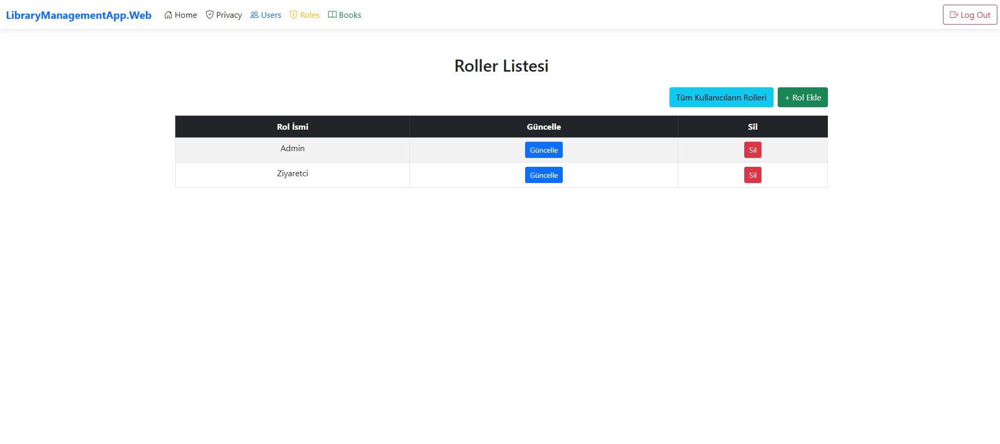
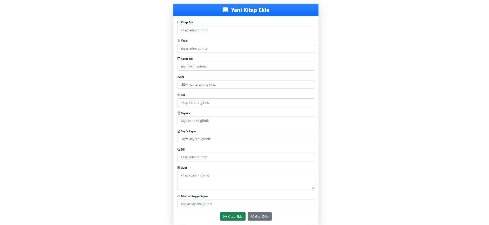

# Kütüphane Yönetim Sistemi
Bu proje, **Identity** işlemlerinin (**kullanıcı yönetimi**, **rol yönetimi**, **rol atama** vb.) yer aldığı bir **Kütüpahane Yönetim Sistemi** uygulamasıdır. Projede **Admin** ve **Ziyaretçi** olmak üzere iki rol bulunmaktadır.

---

## 📃 Proje İçeriği
- Projeyle ilgili tüm görseller en aşağıda mevcuttur.
- **Admin** kullanıcısına otomatik olarak **admin rolü** atanır.
- **Ziyaretçi** kullanıcısına otomatik olarak **ziyaretçi rolü** atanır.
- 10 adet dummy kitap verisi ile başlangıç verisi sağlanır.
- **Cookie tabanlı oturum yönetimi** sayesinde oturumunuz kayıt altına alınır ve tekrar giriş yapmanıza gerek kalmaz.

---

## 👤 Kullanıcı Bilgileri

### Admin Kullanıcısı
- **Kullanıcı Adı**: admin
- **Email**: admin@gmail.com
- **Şifre**: Admin123!

### Ziyaretçi Kullanıcısı
- **Kullanıcı Adı**: ziyaretci
- **Email**: ziyaretci@hotmail.com
- **Şifre**: Ziyaretci123!

---

## 🚀 Özellikler ve Sayfalar

### 1. Kullanıcı Yönetimi (**Users Sayfası**)
- Tüm kullanıcılar listelenir.
- Aşağıdaki işlemler yapılabilir:
  - Kullanıcı ekleme
  - Kullanıcı güncelleme
  - Kullanıcı silme
  - Kullanıcıya rol atama
  - Kullanıcıya ait rolleri görüntüleme ve silme

### 2. Rol Yönetimi (**Roles Sayfası**)
- Tüm roller listelenir.
- Aşağıdaki işlemler yapılabilir:
  - Rol ekleme
  - Rol güncelleme
  - Rol silme
- Ekstra olarak **Tüm Kullanıcıların Rolleri** butonu ile hangi kullanıcının hangi role sahip olduğu görüntülenir.

### 3. Kitap Yönetimi (**Books Sayfası**)
- Tüm kitaplar listelenir.
- Aşağıdaki işlemler yapılabilir:
  - Kitap ekleme
  - Kitap güncelleme
  - Kitap silme
- Kitapların **adı, yazırı ve ISBN** bilgisine göre arama yapılabilir.
- Kitap detaylarına erişmek için **Detaylar** butonu kullanılır.

---

## 🔒 Yetkilendirme ve Erişim Kontrolleri
- **Admin rolüne sahip kullanıcılar** projedeki tüm sayfalara erişebilir ve tüm işlemleri yapabilir.
- **Ziyaretçi rolüne sahip kullanıcılar**, aşağıdaki sayfalara erişemez:
  - Privacy
  - Users
  - Roles
- Yetkisiz erişim denemelerinde kullanıcı **Access Denied** sayfasına yönlendirilir.Örneğin bir ziyaretci rolündeki kişinin kitap düzenleme ekleme silme butonlarını kullanması durumunda.

---

## 💬 Bildirimler ve Pop-Up Mesajlar
- Yapılan **CRUD** işlemleri (**Ekleme, Güncelleme, Silme**) sonrasında **başarı mesajları** ekrana yansıtılır.
- Hata durumlarında uygun **hata mesajları** gösterilir.

---

## 🛠 Proje Kurulumu

### 1. Proje Dosyasını İndirin veya Klonlayın:
```bash
git clone 
```

### 2. Veritabanı Migrasyonlarını Uygulayın:
```bash
dotnet ef database update
```

### 3. Projeyi Başlatın:
```bash
dotnet run
```

---

## 📜 Teknolojiler
- **ASP.NET Core Identity**
- **Entity Framework Core**
- **SQL Server**
- **Bootstrap 5**
- **C# 12 (.NET 8)**

---

## 📌 Sonuç
Bu proje, **Kütüphane Yönetim Sistemi** kapsamında **kullanıcı, rol ve kitap yönetimi** için gerekli olan tüm işlemleri başarıyla sunmaktadır.

Yetkilendirme, oturum yönetimi ve **kullanıcı dostu arayüzü** ile kullanıma hazır bir sistemdir.

**Henüz giriş yapılmamış:**


**Giriş:**


**Kayıt Ol:**


**Admin giriş yaptığında gelen ekran:**
Eğer ziyaretçi giriş yapmış olsaydı, **"Admin"** yerine **"Ziyaretçi olarak giriş yapmaktasınız"** yazardı.  


**Tüm kullanıcıları listeleme:**


**Seçilen kullanıcının bilgilerini güncelleme:**


**Yeni kullanıcı ekleme:**


**Seçilen kullanıcıya atanmış rolleri listeleme:**


**Seçilen kullanıcıya rol atama ve silme:**


**Tüm rolleri listeleme:**


**Seçilen rol bilgisini güncelleme:**


**Yeni rol ekleme:**


**Kullanıcılar ve sahip oldukları rolleri listeleme:**


**Tüm kitapları listeleme:**


**Seçilen kitabın detaylarını görüntüleme:**


**Seçilen kitabın bilgilerini güncelleme:**


**Yeni kitap ekleme:**


**Kitap adı, yazar adı ve ISBN'ye göre arama yapma:**


**Ziyaretçi rolü atanmış kullanıcıların erişim kısıtlamaları:**
- **Privacy**, **Users**, **Books** butonlarına bastığında karşılaşacağı sayfa:  
- Kitap ekleme, silme ve güncelleme yapmaya çalıştığında karşılaşacağı sayfa:  

